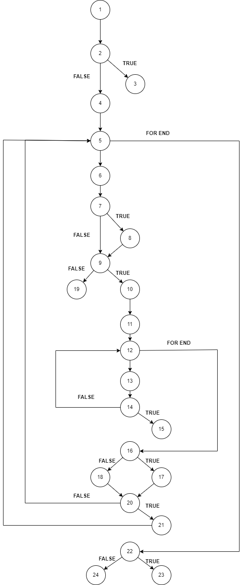

# Втора лабораториска вежба по Софтверско инженерство

## Нина Јовановиќ, бр. на индекс 173040

###  Control Flow Graph

Во кодот онзачена е секоја линија со реден број како коментар. Тие редни броеви се користат во графот.

### Цикломатска комплексност

N=24 (број на јазли, означени во самиот код)
E=27
V(G)=E-N+2=27-24+2=5

### Тест случаи според критериумот  Every branch

item1 = Item(name: "", code: "123", price: 45, discount: 0.0)
item2 = Item(name: "", code: "0123", price: 301, discount: 0.1)
item3 = Item(name: "item3", code: null, price: 45, discount: 0.0)

item10 = Item(name: "", code: "c123", price: 45, discount: 0.0)

| Arcs		| (allItems=null, payment=0) | (allItems=[item1, item2, item3], payment=0) | (allItems=[item10], payment=0) | (allItems=[item1, item2], payment=80) | (allItems=[item1, item2], payment=20) |
|---------------|----------------------------|---------------------------------------------|--------------------------------|---------------------------------------|---------------------------------------|
| 1,2-3		| 	       *	     | 		 			    | 				     	    | 					    | 					    |
| 1,2-4		| 			     | 		  *			    | 				     	    | *					    | *					    |
| 4,5-6		| 			     | 		  *			    | 				     	    | *					    | *					    |
| 4,5-22	| 			     | 		  *			    | 				     	    | *					    | *					    |
| 6,7-8		| 			     | 		  *			    | 			  	            | *					    | *					    |
| 6,7-9		| 			     |            *             	    | 				     	    | *					    | *					    |
| 9-19		| 			     | 		  *			    | 				            | 					    | 					    |
| 9-10		| 			     | 		  *			    | 				            | * 				| 	*				    |
| 10,11,12-13	| 			     | 		  *			    | 				     	    | *					    | 	*				    |
| 10,11,12-16	| 			     | 		  *			    | 				            | *					    | 	*				    |
| 13,14-15	| 			     | 					    | 			*	            | 					    | 					    |
| 13,14-12	| 			     | 		  *			    | 				            | *					    | 	*				    |
| 16-17		| 			     | 		  *			    | 				     	    | *					    | 	*				    |
| 16-18 	| 			     | 		  *			    | 				            | *					    |	*				    |
| 20-21		| 			     | 		  *			    | 				     	    | *					    | 	*				    |
| 20-5		| 			     |            *			    | 				     	    | *					    | 	*				    |	
| 22-23		| 			     | 					    | 					    | 			*		    | 					    |
| 22-24		| 			     | 					    | 					    | 					    | 			*		    |

Првата колона е тест кој се однесува ако пратиме NULL покажувач за листата. Во тој случај ќе се фрли исклучок и ќе терминира програмата.

Втората колона има листа која содржи три објекти со специфични карактеристики:
- првиот објект 
-   - празно име - со цел да се влезе во кодот на линија 8
-   - попуст 0 - со цел да се изврши линија 18
-   - и исто така да не се изврши линија 21
- вториот објект
-   - празно име - со цел да се влезе во кодот на линија 8
-   - попуст 0.1 - со цел да се изврши линија 17
-   - и исто така да се изврши линија 21
- третиот објект
-   - баркодот = NULL, за да фрли исклучок на линија 19

Третата колона е тест пример кај што листата содржи еден објект кој во баркодот има невалиден карактер, со цел да се фрли исклучок на линија 15.

Четвртата колона која покрај тоа што се поклопува со поголем дел од тестовите од втората, таа не го содржи третиот објект што значи функцијат ќе се изврши до крај и нема да фрли исклучок. Во овој тест износот е исто така битен. Поставена е вредност така што износот за плаќање ќе биде доволен за елементите од листата.

Петата колона е идентична на четврта со разлика во тоа што износот за плаќање е помал од потребниот.

### Тест случаи според критериумот Multiple Condition

item = Item(name: "", code: "0123", price: 301, discount: 0.1)
item1 = Item(name: "", code: "0123", price: 300, discount: 0.1)
item2 = Item(name: "", code: "0123", price: 301, discount: 0)
item3 = Item(name: "", code: "123", price: 301, discount: 0.1)

|Combination|Possible Test Case|
|-----------|------------------|
|T,T,T	    | allItems=[item], payment=0 |
|F,X,X	    | allItems=[item1], payment=0 |
|X,F,X      | allItems=[item2], payment=0 |
|X,X,F	    | allItems=[item3], payment=0 |

Доволно се само четири тест примери бидејќи условот е со логичко И поврзано. Имено питребни се случаевите кај што сите се ТОЧНИ за да помине условот, и по еден пример кај што еден од под-изразите е НЕТОЧЕН, затоа што доволно е еден од нив да е неточен за условот да не помине во целина.

### Објаснување на напишаните unit tests

Двата теста соодвествуваат на последните две колони од Every Branch барањето т.е. еден тест за кој нема доволно пари и еден за спротивниот случај.